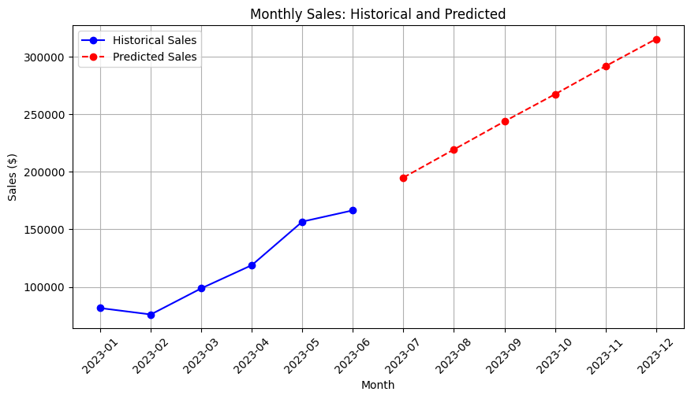

# Sales Prediction using Machine Learning

This project explores predicting future sales for a shop based on historical sales data. It utilizes various machine learning models and evaluates their performance.

## Data

The sales data is assumed to be located in an Excel file named 'Shop Sales.xlsx' within the 'input' directory. The data includes columns like 'transaction_date', 'transaction_qty', 'unit_price', and 'product_type'.

## Project Steps

1. **Data Loading and Cleaning:**
   - Load the sales data from the Excel file using pandas.
   - Preprocess the data by creating new features like 'total_cost' and 'Month'.
   - Explore and visualize the data to understand the sales trends.

2. **Machine Learning for Sales Prediction:**
   - Split the data into training and testing sets.
   - Train three different machine learning models:
      - Linear Regression
      - Random Forest Regression
      - XGBoost Regression
   - Evaluate the performance of each model using metrics like Mean Squared Error (MSE) and R-squared.
   - Perform hyperparameter tuning for the XGBoost model to improve its performance.

3. **Future Sales Prediction:**
   - Use the best performing model to predict sales for future months.
   - Visualize the historical sales data along with the predicted sales for future months.

## Results

The project investigates the effectiveness of different machine learning models in predicting sales. XGBoost Regression with tuned hyperparameters achieved the best performance among the tested models based on the Mean Squared Error metric.
](result.png)
## Future Improvements

- Incorporate additional features that might influence sales, such as holidays, promotions, or economic indicators.
- Explore other machine learning models like Support Vector Machines (SVM) or Neural Networks.
- Implement techniques to handle imbalanced data if product categories are not evenly distributed.

This project provides a basic framework for sales prediction using machine learning. It can be further enhanced by incorporating more sophisticated techniques and data analysis methods.
